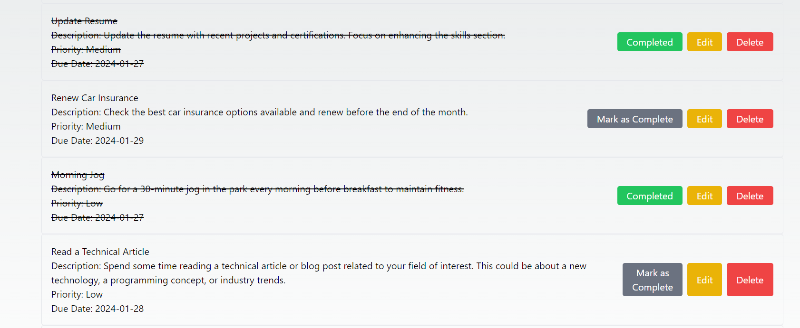

# Todo List App

[](LICENSE)
[](https://github.com/blockchaincyberpunk1/todo-list-app/stargazers)
[](https://github.com/blockchaincyberpunk1/todo-list-app/network/members)
[](https://github.com/blockchaincyberpunk1/todo-list-app/issues)
[](https://github.com/blockchaincyberpunk1/todo-list-app/pulls)

## Table of Contents

- [Todo List App](#todo-list-app)
  - [Table of Contents](#table-of-contents)
  - [Introduction](#introduction)
  - [Demo](#demo)
  - [Installation](#installation)
  - [Features](#features)
  - [Usage](#usage)
  - [API Endpoints (Backend)](#api-endpoints-backend)
  - [Contributing](#contributing)
  - [License](#license)

## Introduction

The Todo List App is a full-stack application that allows users to manage their daily tasks effectively. The frontend is built with React, providing a dynamic and responsive user interface, while the backend, developed in Node.js, handles data management and API services.

## Demo




Explore a live demo of the Todo List App [here](https://immense-castle-11296-affffce4cc46.herokuapp.com/).


- **Frontend**:
  - React: Frontend library for building user interfaces.
  - CSS/Tailwind: For styling.
- **Backend**:
  - Node.js: JavaScript runtime for server-side logic.
  - Express: Web application framework for Node.js.
  - MongoDB: Database for storing tasks.
  - Mongoose: ODM for MongoDB and Node.js.

## Installation

To set up the application locally, follow these steps:


1. Clone the repository:

   ```bash
   git clone https://github.com/blockchaincyberpunk1/todo-list-app

2. Navigate to the backend/client directory:

   ```bash
   cd server or cd client
   ```

3. Install dependencies:

   ```bash
   npm install
   ```

## Features

The server provides the following endpoints:

- Add, delete, and update tasks.
- Prioritize tasks.
- Set due dates for tasks.
- Responsive design for various devices.
  
## Usage

After starting the app, add new tasks using the form. Tasks can be edited, marked as complete, or deleted. 

## API Endpoints (Backend)

- **GET /api/todos**: Retrieve all todos.
- **POST /api/todos**: Create a new todo.
- **PUT /api/todos/:id**: Update a todo by ID.
- **DELETE /api/todos/:id**: Delete a todo by ID.

## Contributing

We welcome contributions to improve the backend logic, add new features, or fix bugs. 

## License

This project is licensed under the MIT License - see the [LICENSE](LICENSE) file for details.

